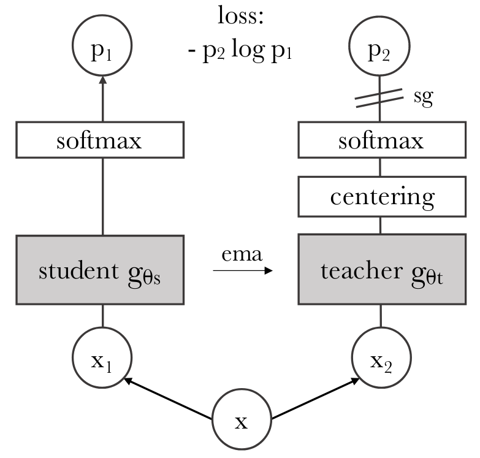

``ssljax`` implements state-of-the-art self-supervised learning models in `Jax <https://github.com/google/jax>`_ with `Flax <https://github.com/google/flax>`_ and `Optax <https://github.com/deepmind/optax>`_.

Overview
========

In :class:`~ssljax.train.SSLTrainer`, samples are passed through :class:`~ssljax.model.branch.Branch`
composed of a model body, projector, and (optionally) predictor. Each branch is assigned a
:class:`~ssljax.augment.pipeline.Pipeline` of :class:`~ssljax.augment.augmentation.augmentation.Augmentation` that is applied
to each sample before it is passed through the branch. Outputs are compared and a loss is backpropagated,
with parameters managed by Optax :class:`~ssljax.optimizers.optimizers.Optimizer`.

Here we show how popular self-supervised learning models fit into our abstraction, and provide benchmarks.

Benchmarks (in ssljax)

    ============ ========= =================== =================== ==================== ====================
    Model        Reference ImageNet 1k (Top 1) ImageNet 1k (Top 5) ImageNet 10k (Top 1) ImageNet 10k (Top 5)
    ============ ========= =================== =================== ==================== ====================
    Weak Sup
    Strong Sup
    MoCo
    PIRL
    SimCLR
    SimCLR v2
    BYOL
    DINO
    SWAV
    PAWS
    ============ ========= =================== =================== ==================== ====================

Abstraction (in ssljax)

    ========= ========================== =======================================================
    Model     Reference                  Config
    ========= ========================== =======================================================
    MoCo      :footcite:t:`2019:he`
    PIRL      :footcite:t:`2019:misra`
    SimCLR    :footcite:t:`2020:chen`    :ref:`SIMCLR: Contrastive Learning and Negative Pairs>`
    SimCLR v2 :footcite:t:`2020:chen2`
    BYOL      :footcite:t:`2020:grill`   :ref:`config<Bootstrap Your Own Latent (BYOL)>`
    DINO      :footcite:t:`2021:caron`   :ref:`config<Distillation with No Labels (DINO)>`
    SWAV      :footcite:t:`2020:caron`
    PAWS      :footcite:t:`2021:assran`
    ========= ========================== =======================================================

Background
==========
Many recent breakthroughs in machine learning have been driven by scaling neural models [:footcite:t:`2020:brown`] (add others).

In vision, model performance scales as a power law in both dataset size and model size [:footcite:t:`2021:zhai`].
How do we scale deep learning systems in domains where curated and labeled data is limited?

Early Successes in NLP
----------------------
Large-scale self-supervised pretraining first outperformed its supervised counterpart in natural language processing [:footcite:t:`2008:collobert,2013:mikolov,2014:pennington,2018:devlin,2019:liu`]

Early Approaches in Vision: Pretext Tasks, Contrastive Representations
----------------------------------------------------------------------
Self-supervised learning was adopted more slowly in vision.
One line of research involved pretext tasks where samples provide their own supervisory signal. Representations
learned through pretext tasks are then transferred by supervised fine-tuning on labeled data.
# many citations here

Another line of work developed contrastive losses [:footcite:t:`2005:chopra,2015:schroff,2010:gutmann,2019:henaff,2019:hjelm`]
which are now ubiquitous in self-supervised learning.

Here we introduce popular self-supervised learning architectures and their specifications
in ``ssljax``.

.. _moco:
MOCO
====

.. _simclr:
SIMCLR
======
Motivated by promising results in contrastive representation learning [:footcite:t:`2014:dosovitskiy,2018:oord,2019:bachman`],
SimCLR [:footcite:t:`2020:chen`] was the first technique to match supervised ResNet50 performance on ImageNet by training a
linear classifier on self-supervised features.

.. image:: _static/images/simclr.png

.. _simclr2:
SIMCLR2
=======

.. image:: _static/images/simclr2.png

.. _byol:
Bootstrap Your Own Latent (BYOL)
================================
Introduced in [:footcite:t:`2020:grill`], Bootstrap Your Own Latent replaced the  contrastive prediction of positive and negative pairs. Instead,
the outputs of one network serve as targets for the predictor of another network. In pratice, this approach is more robust to the choice of
image augmentations than methods based on positive and negative pairs.

.. literalinclude:: /config/byol_conf.yaml

.. _dino:
Distillation with No Labels (DINO)
==================================

.. _swav:
SWAV
====

.. _paws:
PAWS
====

.. footbibliography::
